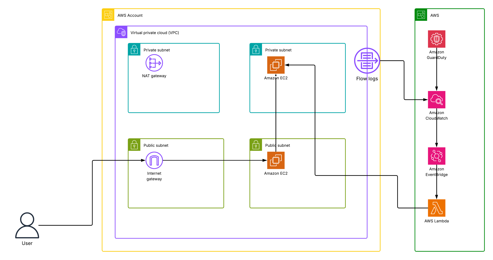
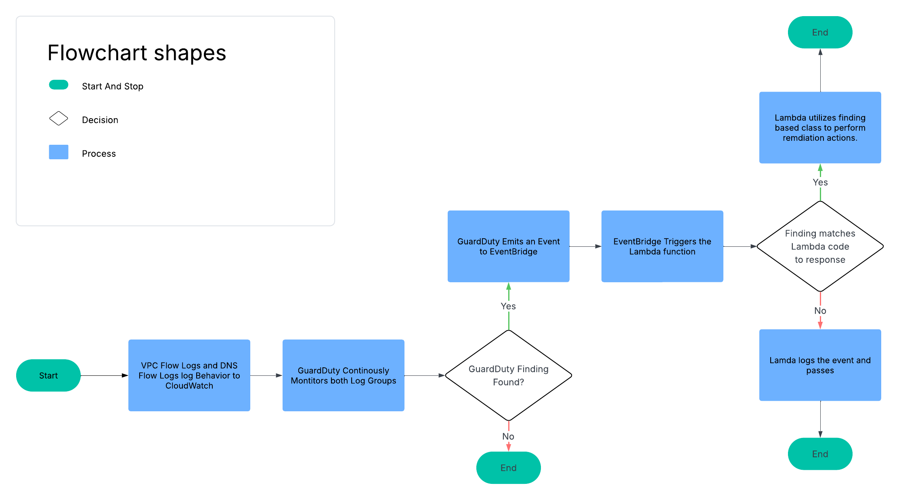
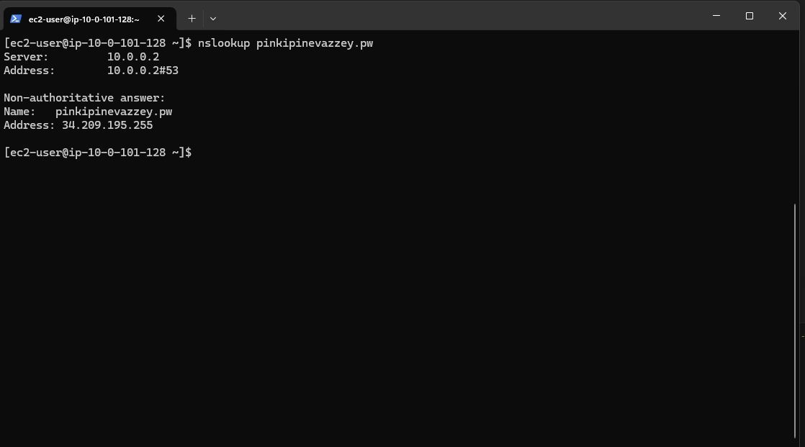
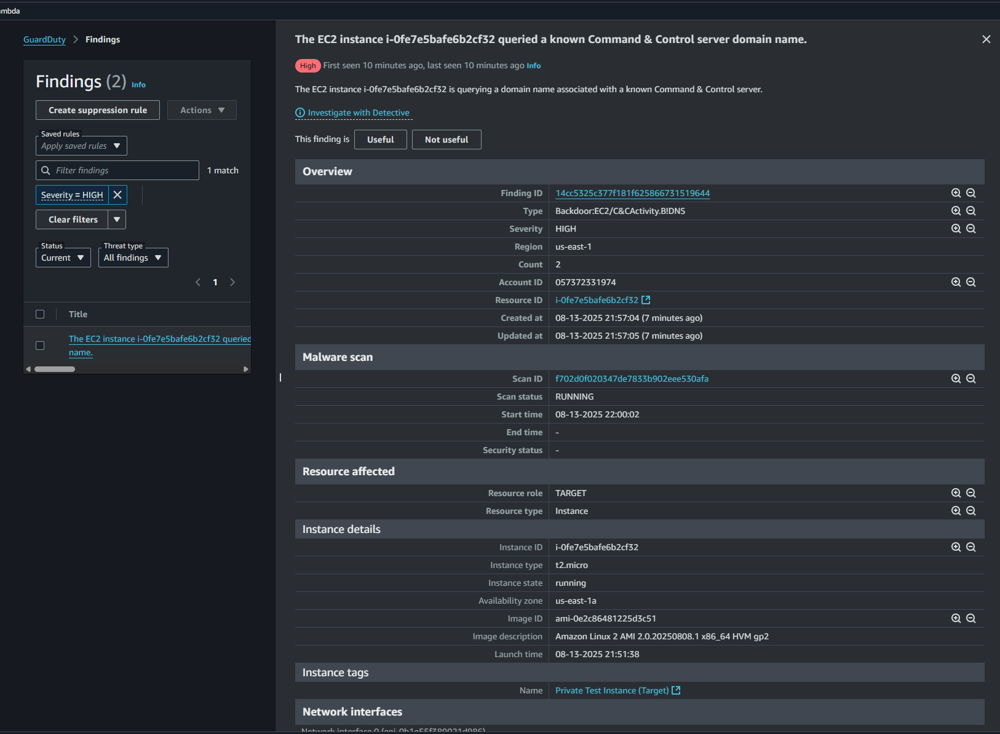
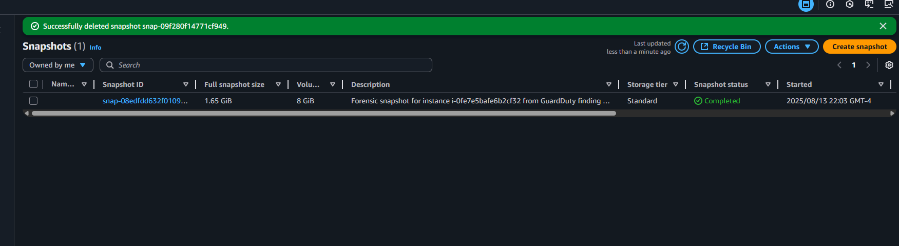

# AWS GuardDuty-Lambda SOAR: Automated Threat Response Pipeline
A comprehensive, serverless Security Orchestration, Automation, and Response (SOAR) pipeline built on AWS to automatically detect and remediate security threats in near real-time.

__Core Technologies__: AWS (Lambda, GuardDuty, EventBridge, EC2, EBS, SNS, SSM Parameter Store), Terraform, Python, Boto3, Pytest

---
## Project Summary
This project automates the entire lifecycle of security threat response within an AWS environment. It addresses the critical need for rapid remediation by leveraging an event-driven, serverless architecture. When Amazon GuardDuty detects a potential compromise (e.g., an EC2 instance communicating with a malicious C2 server), the system automatically triggers a multi-step workflow to contain, preserve evidence from, and eradicate the threat, all without manual intervention. The result is a robust, cost-effective, and scalable solution that reduces the Mean Time to Response (MTTR) from hours to minutes.

## Network Diagram


## Process Flow


## Key Contributions & Features
- __Engineered an Event-Driven SOAR Pipeline__: Designed and deployed a serverless architecture using AWS Lambda and EventBridge. The solution actively monitors for GuardDuty findings, filters for specific threat types, and initiates an automated response workflow.
- __Developed a Custom Python Remediation Library ([aws-reflex](https://github.com/blu371ck/aws-reflex))__: Architected and built a clean, object-oriented, and extensible Python library to orchestrate the response logic. The library is type-safe, unit-tested with pytest, and packaged as an AWS Lambda Layer for modularity and reuse. (The package used in this demonstration is just for demonstration. I am working on building the actual full library. You can check its progress here [GuardDuty-SOAR](https://github.com/blu371ck/GuardDuty-SOAR)
- __Implemented a Full Infrastructure as Code (IaC) Deployment__: Utilized Terraform to define and manage all required AWS infrastructure, including VPCs, EC2 instances, security groups, IAM roles, and serverless components. This ensures consistent, repeatable, and version-controlled deployments.
- __Automated a Multi-Step Threat Remediation Workflow__: The core logic, executed by the Lambda function, performs the following sequence of actions upon detecting a threat:
- __Containment__: Immediately isolates the compromised EC2 instance by dynamically reassigning it to a "quarantine" security group, blocking all inbound and outbound traffic.
- __Preservation__: Automatically creates an EBS snapshot of the instance's root volume to preserve a point-in-time image for future forensic analysis.
- __Eradication__: Terminates the compromised EC2 instance to remove the active threat from the environment.
- __Notification__: Publishes a detailed report of the detected threat and all actions taken to a security team via an SNS topic and email subscription.
- __Ensured Secure Configuration Management__: Implemented security best practices by managing all application configuration, such as ARNs and resource IDs, through the AWS SSM Parameter Store, eliminating hardcoded secrets and credentials from the codebase.

## Project Structure
```
aws-guardduty-lambda-soar/
├── layers/
│   └── aws_reflex_layer.zip    # The packaged Python library for the Lambda Layer
├── lambda_code/
│   └── lambda_function.py      # The Lambda handler code
├── src/
│   └── aws_reflex/             # The source code for the Python library
├── terraform/
    ├── modules/                # Modules divided by compute/app/security/networking
    ├── main.tf                 # Main Terraform file
    └── ...
```

---
## Setup and Deployment

### Prerequisites

- An AWS account with appropriate permissions.
- Terraform installed.
- AWS CLI installed and configured.
- Python 3.13+ and uv (or pip) installed.
- GuardDuty enabled on the AWS account.

### Step 1: Configure Your Email

This project will create an SNS topic and subscribe your email to it for notifications. To avoid hardcoding your email, set it as an environment variable.

In PowerShell:

```powershell
$env:TF_VAR_subscriber_email = "your-email@example.com"
```

Bash:

```bash
export TF_VAR_subscriber_email="your-email@example.com"
```

### Step 2: Package the Python Library

The [AWS Reflex](https://github.com/blu371ck/aws-reflex) library is already included as a ZIP file in the `layers` directory of this repository. The Lambda function that uses the library can be found in the `lambda_code` directory.

### Step 3: Deploy the Infrastructure

Navigate to the terraform directory and use Terraform to deploy all the AWS resources.

```
cd terraform
terraform init
terraform fmt
terraform apply
```

When prompted, review the plan and type yes to deploy. This will create the VPC, EC2 instances, SNS topic, SSM parameters, and the Lambda function with its layer.

### Testing the Automation

After deployment, you can test the end-to-end workflow by performing actions on the private EC2 instance, like shown in the demonstration below.

## Demonstration
This section walks through a live demonstration of the Cloud Warden SOAR pipeline, from initial threat simulation to final automated remediation.

### Step 1: Simulate a Threat
The workflow is initiated by simulating a threat from within the private EC2 instance. We use nslookup to perform a DNS query for a domain name that is known to be associated with Command and Control (C2) malware. This action mimics an infected instance attempting to contact its controller.


### Step 2: Threat Detection by GuardDuty
Within 5-15 minutes, Amazon GuardDuty, which is automatically analyzing the VPC's DNS query logs, detects the malicious lookup. It generates a high-severity finding, Backdoor:EC2/C&CActivity.B!DNS, identifying the source instance and the malicious domain.


### Step 3: Automated Response & Remediation
The new GuardDuty finding immediately triggers an Amazon EventBridge rule, which invokes the GuardDuty-SOAR-Responder Lambda function. The aws-reflex library executes the following automated workflow:
- __Containment__: The compromised EC2 instance is instantly isolated by changing its security group to the "quarantine" group, severing all network connections.
- __Preservation__: An EBS snapshot of the instance's root volume is created to preserve evidence for forensic analysis.
- __Eradication__: The compromised instance is terminated to remove the threat from the environment.
- __Notification__: A detailed report of the finding and the actions taken is sent to the security team via the configured SNS topic.

The successful creation of the forensic snapshot and the final email alert confirm that the automated response was executed successfully.


This end-to-end process demonstrates a successful, fully automated detection and response cycle, neutralizing a threat within minutes of its initial activity.
