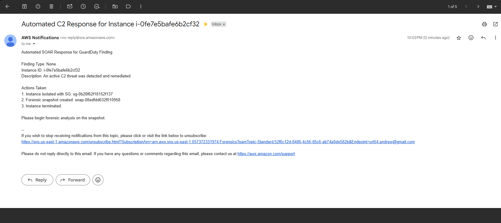

# AWS GuardDuty-Lambda SOAR 🛡️

__AWS GuardDuty-Lambda SOAR__ is a complete, serverless Security Orchestration, Automation, and Response (SOAR) project for AWS. It automatically detects and responds to security threats identified by Amazon GuardDuty, enabling rapid containment of compromised resources.

This project deploys all necessary infrastructure using Terraform and uses a custom Python library [aws-reflex](https://github.com/blu371ck/aws-reflex) deployed as an AWS Lambda Layer to execute remediation workflows.

## Key Features

- __Fully Automated Deployment__: All AWS infrastructure is managed via Terraform for repeatable, version-controlled deployments.
- __Event-Driven & Serverless__: Built on AWS Lambda for a cost-effective, scalable, and low-maintenance SOAR solution.
- __Rapid Threat Containment__: Automatically isolates EC2 instances, preserves evidence via snapshots, and terminates threats within minutes of detection.
- __Secure & Extensible Python Library__: The core logic is a clean, object-oriented, and type-safe Python library that is easy to test and extend with new response handlers.
- __Secure Configuration__: Manages all configuration (ARNs, IDs) via AWS SSM Parameter Store, avoiding hardcoded secrets.

## How It Works

1. __Detect__: Amazon GuardDuty detects a threat (e.g., an EC2 instance communicating with a C2 server) and generates a finding.
2. __Trigger__: An Amazon EventBridge rule filters for GuardDuty findings and invokes the GuardDuty-SOAR-Responder Lambda function.
3. __Orchestrate__: The Lambda function uses the aws-reflex library to identify the correct handler for the specific finding type.
4. __Remediate__: The handler class executes a series of automated response steps using Boto3:
5. __Contain__: The instance's security group is immediately changed to a "quarantine" group, blocking all traffic.
6. __Preserve__: An EBS snapshot of the instance's root volume is created for forensic analysis.
7. __Eradicate__: The compromised instance is terminated.
8. __Notify__: A detailed report is sent to a security team via an SNS topic.

## Project Structure
```
aws-guardduty-lambda-soar/
├── layers/
│   └── aws_reflex_layer.zip    # The packaged Python library for the Lambda Layer
├── lambda_code/
│   └── lambda_function.py      # The Lambda handler code
├── src/
│   └── aws_reflex/             # The source code for the Python library
├── terraform/
    ├── modules/                # Modules divided by compute/app/security/networking
    ├── main.tf                 # Main Terraform file
    └── ...
```

## Setup and Deployment

### Prerequisites

- An AWS account with appropriate permissions.
- Terraform installed.
- AWS CLI installed and configured.
- Python 3.13+ and uv (or pip) installed.
- GuardDuty enabled on the AWS account.

### Step 1: Configure Your Email

This project will create an SNS topic and subscribe your email to it for notifications. To avoid hardcoding your email, set it as an environment variable.

In Windows PowerShell:

```powershell
$env:TF_VAR_subscriber_email = "your-email@example.com"
```

### Step 2: Package the Python Library

The aws-reflex library must be packaged as a .zip file to be used as a Lambda Layer. We provide the known-working ZIP in this repo, but if you make any changes
you will need to rebuild the package and zip it into a Layer/Lambda structure.
1. Navigate to the project root.
2. Install build dependencies and build the wheel file:

```
uv pip install build
python -m build
```

3. Create the layer package:

```
# Create the required directory structure
mkdir -p layers/python

# Unzip the wheel file into the target directory
unzip dist/aws_reflex-*.whl -d layers/python

# Create the final zip file
cd layers
zip -r ../aws_reflex_layer.zip .
cd ..
```

This will create the aws_reflex_layer.zip file inside the root layers directory.

### Step 3: Deploy the Infrastructure

Navigate to the terraform directory and use Terraform to deploy all the AWS resources.

```
cd terraform
terraform init
terraform fmt
terraform apply
```

When prompted, review the plan and type yes to deploy. This will create the VPC, EC2 instances, SNS topic, SSM parameters, and the Lambda function with its layer.

### Testing the Automation

After deployment, you can test the end-to-end workflow by generating a sample GuardDuty finding.

Get your GuardDuty Detector ID:

```
aws guardduty list-detectors --query 'DetectorIds[0]' --output text
```

Generate a Sample C2 Finding:
Replace <your_detector_id> with the ID from the previous step.

```
aws guardduty create-sample-findings \
    --detector-id <your_detector_id> \
    --finding-types "Backdoor:EC2/C&CActivity.B"

```

This will trigger the EventBridge rule and invoke your Lambda function. You can monitor the execution in the CloudWatch Log Group for the GuardDuty-SOAR-Responder function and should receive an email notification from SNS.

### Testing the Library

Unit tests for the aws-reflex library are located in the tests/ directory and use pytest.

Install development dependencies:

```
uv pip install pytest pytest-mock boto3-stubs
```

Run tests from the project root:

```
pytest
```

## Demonstration
This section walks through a live demonstration of the Cloud Warden SOAR pipeline, from initial threat simulation to final automated remediation.

### Step 1: Simulate a Threat
The workflow is initiated by simulating a threat from within the private EC2 instance. We use nslookup to perform a DNS query for a domain name that is known to be associated with Command and Control (C2) malware. This action mimics an infected instance attempting to contact its controller.


### Step 2: Threat Detection by GuardDuty
Within 5-15 minutes, Amazon GuardDuty, which is automatically analyzing the VPC's DNS query logs, detects the malicious lookup. It generates a high-severity finding, Backdoor:EC2/C&CActivity.B!DNS, identifying the source instance and the malicious domain.


### Step 3: Automated Response & Remediation
The new GuardDuty finding immediately triggers an Amazon EventBridge rule, which invokes the GuardDuty-SOAR-Responder Lambda function. The aws-reflex library executes the following automated workflow:
- __Containment__: The compromised EC2 instance is instantly isolated by changing its security group to the "quarantine" group, severing all network connections.
- __Preservation__: An EBS snapshot of the instance's root volume is created to preserve evidence for forensic analysis.
- __Eradication__: The compromised instance is terminated to remove the threat from the environment.
- __Notification__: A detailed report of the finding and the actions taken is sent to the security team via the configured SNS topic.

The successful creation of the forensic snapshot and the final email alert confirm that the automated response was executed successfully.


This end-to-end process demonstrates a successful, fully automated detection and response cycle, neutralizing a threat within minutes of its initial activity.